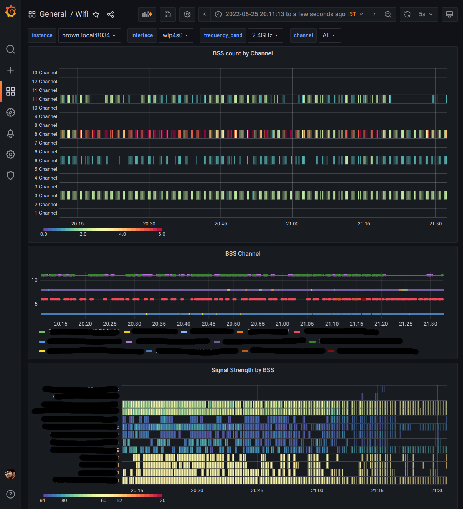

# wifi_exporter

Prometheus exporter that exposes Wireless interfaces information.

## Metrics

| Name  | Description | Labels |
| -- | -- | -- |
| wifi_signal_db | BSS signal in dB (RSSI) | `interface`, `BSSID`, `SSID`, `frequency_MHz`, `frequency_band`, `channel`, `flags` |
| wifi_channel | BSS Channel | `interface`, `BSSID`, `SSID`,`frequency_band`, `flags` |
| wifi_scan_duration_seconds | How long scanning took | N/A |

## Grafana Dashboard

A dashboard is available [here](https://github.com/fornellas/wifi_exporter/tree/master/grafana).

